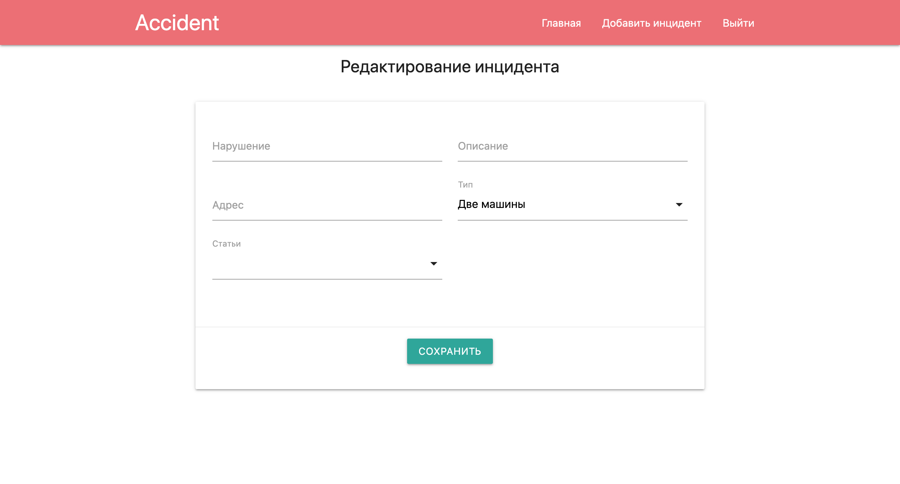

# Car Accident
 &nbsp;&nbsp;

<ul>
    <li>
        <a href="#about">О проекте</a>
        <ul>
            <li><a href="#description">Описание</a></li>
            <li><a href="#technologies">Технологии</a></li>
            <li><a href="#structure">Структура</a></li>
            <li><a href="#scheme">Схема БД</a></li>
        </ul>
    </li>
    <li>
        <a href="#intarface">Пользовательский интерфейс</a>
        <ul>
            <li><a href="#main_page">Главная страница</a></li>
            <li><a href="#new_accident">Новое нарушение</a></li>
            <li><a href="#edit_accident">Редактирование нарушения</a></li>
            <li><a href="#login_page">Регистрация/авторизация</a></li>
        </ul>
    </li>
    <li>
        <a href="#links">Полезные ссылки</a>
    </li>
    <li>
        <a href="#contact">Контакты</a>
    </li>
</ul>

<h2><a name="about">О проекте</a>&nbsp;&nbsp;<a href="#menu">&#9650;</a></h2>
<h4><a name="description">Описание</a>&nbsp;&nbsp;<a href="#menu">&#9650;</a></h4>

    Проект предназначен для знакомства с фремворком Spring и его модулями: MVC, ORM, Data, Security.

    Приложение задумано как база автонарушений. Оно представляет собой простую систему с авторизацией и регистрацией пользователей,
    в которой реализованы CRUD операции над ее элементами.

<h4><a name="technologies">Технологии</a>&nbsp;&nbsp;<a href="#menu">&#9650;</a></h4>
<ul>
    <li>Java 14</li>
    <li>Spring (MVC, ORM, Data, Security), JSP, JSTL</li>
    <li>PostgreSQL, Hibernate, JDBC</li>
    <li>Maven, Tomcat</li>
    <li><a href="https://materializecss.com">Material Design library</a></li>
</ul>

<h4><a name="structure">Структура</a>&nbsp;&nbsp;<a href="#menu">&#9650;</a></h4>
<pre><code>.
|-db
|---scripts
|-src
|---main
|-----java
|-------ru
|---------reybos
|-----------accident
|-------------config
|-------------control
|-------------model
|-------------repository
|-------------service
|-----resources
|-----webapp
|-------WEB-INF
|---------view
└-----------accident
</code></pre>

<h4><a name="scheme">Схема БД</a>&nbsp;&nbsp;<a href="#menu">&#9650;</a></h4>

  

<h2><a name="build">Сборка</a>&nbsp;&nbsp;<a href="#menu">&#9650;</a></h2>
<ol>
    <li>
        Для успешной сборки и работы проекта на вашем компьютере должны быть установлены:
        <ol>
            <li>JDK 14(+)</li>
            <li>Maven</li>
            <li>PostgreSQL</li>
            <li>Tomcat</li>
        </ol>
    </li>
    <li>
        В PostgreSQL создайте базу с именем "accident"
    </li>
    <li>
        Скачайте проект к себе на компьютер с помощью команды 
        <code>git clone https://github.com/ReyBos/job4j_car_accident</code> 
        перейдите в корень проекта <code>cd job4j_car_accident</code>
    </li>
    <li>
        Добавьте настройки для доступа к базе данных, для этого внесите соответствующие изменения в файле 
        <code>src/main/resources/app.properties</code>
    </li>
    <li>
        Выполните запросы к базе данных из папки <code>db/scripts</code>
    </li>
    <li>
        Выполните команду <code>mvn install</code> в корне проекта для его сборки 
        В случае успешной сборки появится файл <code>target/car-accident-&#60;version&#62;.war</code> 
        переименуйте его в <code>car-accident.war</code>
    </li>
    <li>
        Для запуска веб-приложения вам нужно скопировать <code>car-accident.war</code> в папку <code>webapps</code> вашего Tomcat
    </li>
    <li>
        После запуска сервера приложение будет доступно по адресу 
        <a href="http://localhost:8080/car-accident/">http://localhost:8080/car-accident/</a>
    </li>
</ol>

<h2><a name="intarface">Пользовательский интерфейс</a>&nbsp;&nbsp;<a href="#menu">&#9650;</a></h2>

<h3><a name="main_page">Главная страница</a>&nbsp;&nbsp;<a href="#menu">&#9650;</a></h3>

    На главной странице собраны все нарушения с основной информацией.

  

<h3><a name="new_accident">Новое нарушение</a>&nbsp;&nbsp;<a href="#menu">&#9650;</a></h3>

    Форма для создания нового нарушения

  

<h3><a name="edit_accident">Редактирование нарушения</a>&nbsp;&nbsp;<a href="#menu">&#9650;</a></h3>

    Форма для редактирования нарушения такая же как и при создании нового, только с заполненными данными

  

<h3><a name="login_page">Регистрация/авторизация</a>&nbsp;&nbsp;<a href="#menu">&#9650;</a></h3>

    Для того что бы пользователю был доступен функционал приложения, он должен быть зарегистрирован/авторизован.
    В приложении предусмотрен механизм предупреждения пользователя о возникших проблемах в процессе авторизации/регистрации,
    пример можно увидеть на скриншоте ниже

  

<h2><a name="links">Полезные ссылки</a>&nbsp;&nbsp;<a href="#menu">&#9650;</a></h2>

Ресурсы которые были полезны при создании проекта

<ul>
    <li>
        <strong><a href="https://stackoverflow.com/questions/14537546/how-to-get-generated-id-after-i-inserted-into-a-new-data-record-in-database-usin">link</a></strong>
        - получить id вставленной записи с помощью Spring JDBCTemplate
    </li>
    <li>
        <strong><a href="https://stackoverflow.com/questions/17771306/spring-how-to-use-keyholder-with-postgresql">link</a></strong>
        - указать какой столбец является id вставленной записи, если spring это не известно
    </li>
    <li>
        <strong><a href="https://docs.spring.io/spring-framework/docs/current/reference/html/data-access.html">link</a></strong>
        - работа с БД Spring
    </li>
    <li>
        <strong><a href="https://intellij-support.jetbrains.com/hc/en-us/community/posts/360007103039--Solved-Unable-to-resolve-table-name">link</a></strong>
        - когда idea не видит таблицы в коде (нужно добавить корректную базу в настройках)
    </li>
    <li>
        <strong><a href="https://stackoverflow.com/questions/42871038/from-unexpected-when-createquery">link</a></strong>
        - когда idea подчеркивает hibernate запросы по типу “from unexpected”
    </li>
    <li>
        <strong><a href="https://habr.com/ru/post/435114/">link</a></strong>
        - кратко про Spring Data
    </li>
    <li>
        <strong><a href="https://stackoverflow.com/questions/29602386/how-does-the-fetchmode-work-in-spring-data-jpa">link</a></strong>
        - eager загрузка полей в Spring Data (плюс ссылка на доку)
    </li>
    <li>
        <strong><a href="https://www.baeldung.com/spring-security-taglibs">link</a></strong>
        - Spring security теги, можно например закрыть доступ по роли/авторизации к какой-то части страницы
    </li>
    <!--<li>
        <strong><a href="">link</a></strong>
        - сервлеты и Ajax
    </li>-->
</ul>

<h2><a name="contact">Контакты</a>&nbsp;&nbsp;<a href="#menu">&#9650;</a></h2>

Связаться со мной по всем интересующим вопросам вы можете здесь:

&nbsp;&nbsp;
&nbsp;&nbsp;
&nbsp;&nbsp;
&nbsp;&nbsp;
&nbsp;&nbsp;
